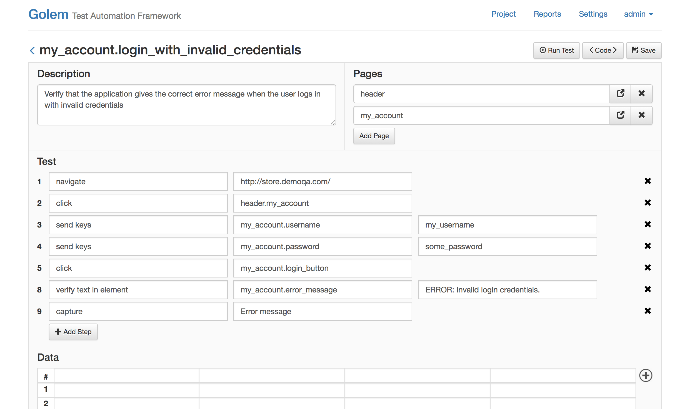
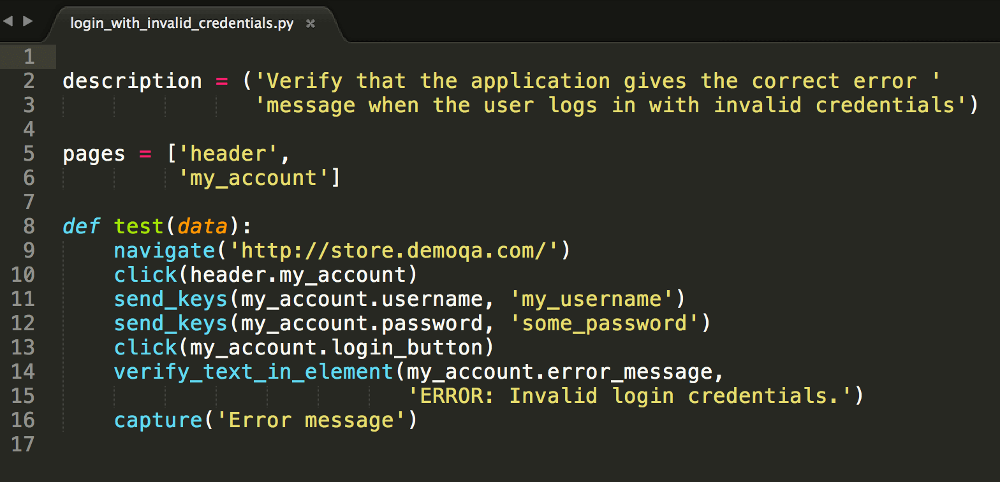
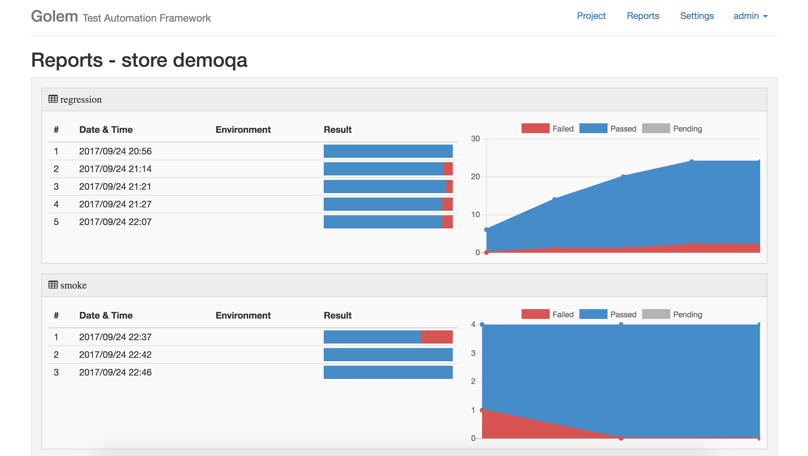
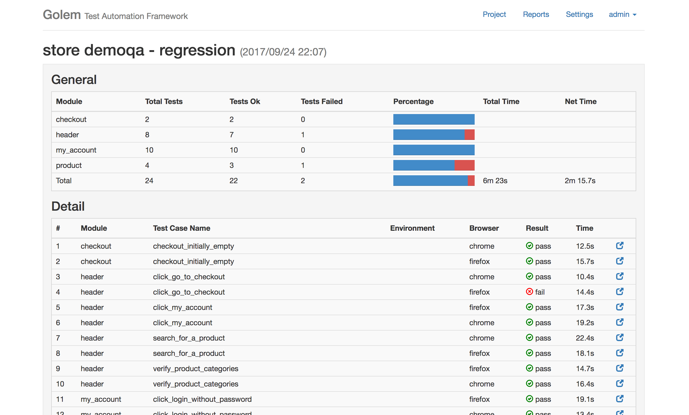
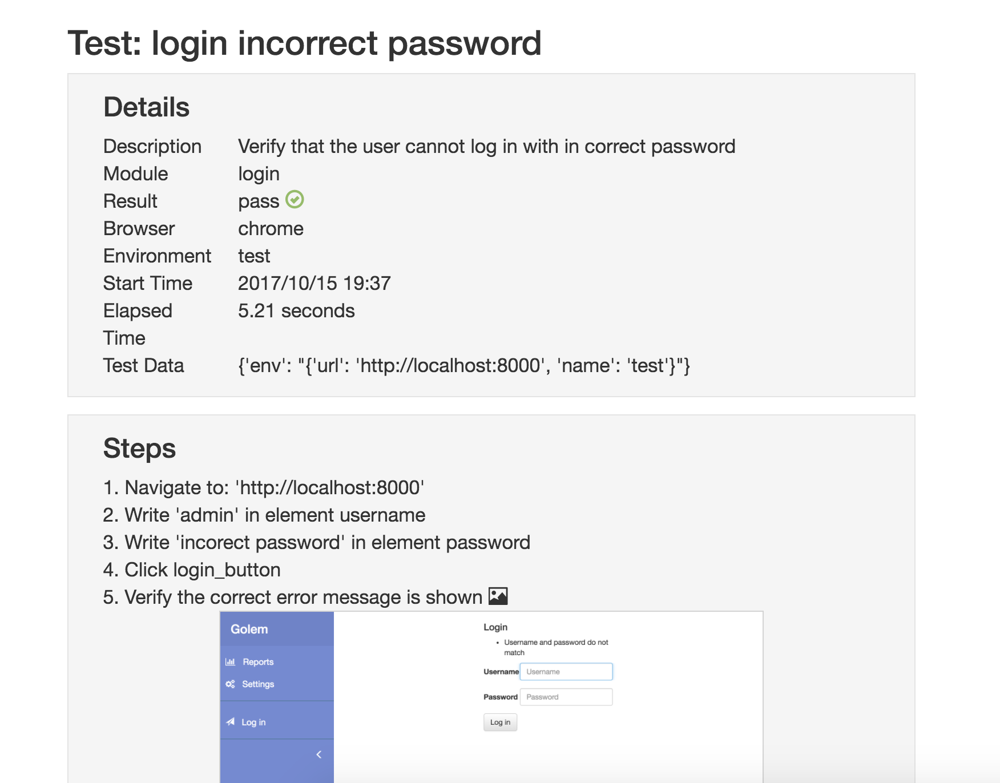

Golem - Test Automation Framework 
==================================================
[](https://travis-ci.org/lucianopuccio/golem)
[](https://golem-framework.readthedocs.io/en/latest/?badge=latest)
[](http://makeapullrequest.com)
[](https://gitter.im/golem-framework/golem?utm_source=badge&utm_medium=badge&utm_campaign=pr-badge&utm_content=badge)


Intro
--------------------------------------

>Automate end to end tests in minutes, not hours.


Golem is a complete test automation tool and framework for end-to-end testing. It creates powerful, robust and maintainable test suites, it's easy to learn even without a lot of programming knowledge. It is based on Selenium Webdriver and it can be extended using Python.

**It can:**
* Use the Page Object pattern
* Write tests with multi data sets (data-driven)
* Run tests in parallel.
* Test APIs
* Run tests remotely (Selenium Grid or a cloud testing provider)
* It can be executed from Jenkins or any other CI tool 


**It has:**
* A complete GUI module (a web application) to write and execute tests
* A reporting engine and a web reports module
* An interactive console


**Please note**: Golem is still in beta. Read the changelog before upgrading.

***

## Contents

* [Screen Captures](#screen-captures)
* [Pre-requisites](#pre-requisites)
* [Installation](#installation)
* [Quick Start](#quick-start)
* [Documentation](#documentation)
* [Example Projects](#documentation)
* [Roadmap](#roadmap)
* [License](#license)


Screen Captures
--------------------------------------

**Test Builder**
<p align="center">
    
</p>


**Test as Pure Python Code**
<p align="center">
    
</p>


**Report Dashboard**
<p align="center">
    
</p>


**Execution Report**
<p align="center">
    
</p>


**Test Execution Detail**
<p align="center">
    
</p>


Pre-requisites
--------------------------------------

Basic knowledge of Selenium Webdriver is required. Check out [this docs](https://golem-framework.readthedocs.io/en/latest/installation.html) first.


Installation
--------------------------------------

Golem works with Python 3.4+

```
pip install golem-framework
```

Read the full installation guide here: [https://golem-framework.readthedocs.io/en/latest/installation.html](https://golem-framework.readthedocs.io/en/latest/installation.html)

Quick Start
--------------------------------------

**Create a test directory anywhere in your machine**

```
golem-admin createdirectory <test_directory>
```

**Download the latest webdriver executables** 
Note: Golem needs the latest webdrivers in order to work, by default, it will pick up the executables placed in the <test_directory>/drivers directory, this setting can be overriden from the settings.
The latests versions of the webdrivers can be found here:
* Chrome: (https://sites.google.com/a/chromium.org/chromedriver/)
* Firefox: (https://github.com/mozilla/geckodriver/releases)

For more information check [this page](https://golem-framework.readthedocs.io/en/latest/web-drivers.html) of the documentation.

**Start the Web Module**

```
cd <test_directory>
golem gui
```


The Web Module can be accessed at http://localhost:5000/

By default, the following user is available: username: *admin* / password: *admin*


Documentation
--------------------------------------

Read the full documentation here: [https://golem-framework.readthedocs.io/](https://golem-framework.readthedocs.io/)


Example Projects
--------------------------------------

Here is a repo with example working projects usign Golem: [https://github.com/lucianopuccio/golem-demo](https://github.com/lucianopuccio/golem-demo)

Roadmap
--------------------------------------

- Integrate with Appium for mobile testing
- Better integration with Sauce Labs
- Improve API test Golem actions
- Video recording


License
--------------------------------------

[MIT](https://tldrlegal.com/license/mit-license)