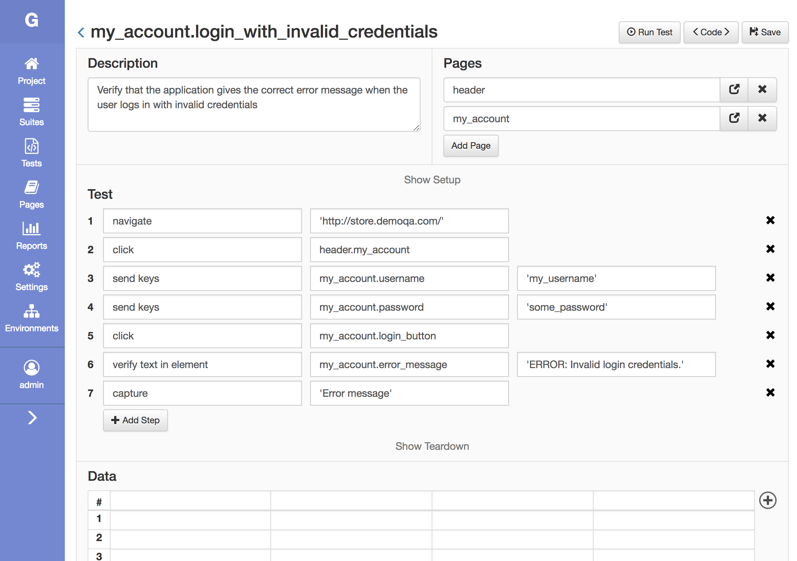

Golem - Test Automation 
==================================================
[](https://travis-ci.org/golemhq/golem)
[](https://golem-framework.readthedocs.io/en/latest/?badge=latest)
[](https://gitter.im/golem-framework/golem?utm_source=badge&utm_medium=badge&utm_campaign=pr-badge&utm_content=badge)

Intro
--------------------------------------

Golem is a complete test automation tool for web browser testing.
It creates powerful, robust and maintainable test suites, it's easy to learn even without a lot of programming knowledge.
It is based on Selenium Webdriver and it can be extended using Python.

**It can:**
* Use the Page Object pattern
* Write tests with multi data sets (data-driven)
* Run tests in parallel.
* Test APIs
* Run tests remotely (Selenium Grid or a cloud testing provider)
* It can be executed from Jenkins or any other CI tool 

**It has:**
* A complete GUI module (a web application) to write and execute tests
* A reporting engine and a web reports module
* An interactive console

**Please note**: Golem is still in beta. Read the changelog before upgrading.

***

## Contents

* [Screen Captures](#screen-captures)
* [Installation](#installation)
* [Quick Start](#quick-start)
* [Documentation](#documentation)
* [Questions](#questions)
* [Contributing](#contributing)
* [License](#license)

Screen Captures
--------------------------------------

**Test Builder**
<p align="center">
    
</p>

**Test are Python Code**
<p align="center">
    
</p>

**Report Dashboard**
<p align="center">
    
</p>

**Execution Report**
<p align="center">
    
</p>

**Test Execution Detail**
<p align="center">
    
</p>

Installation
--------------------------------------

Golem works with Python 3.5+

```
pip install golem-framework
```

Read the full installation guide here: [https://golem-framework.readthedocs.io/en/latest/installation.html](https://golem-framework.readthedocs.io/en/latest/installation.html)

Quick Start
--------------------------------------

**Create a test directory anywhere in your machine**

```
golem-admin createdirectory <test_directory>
```

**Download the latest webdriver executables**

```
cd <test_directory>
webdriver-manager update
``` 

Webdriver executables are downloaded to the *drivers* folder. For more information check [this page](https://golem-framework.readthedocs.io/en/latest/browsers.html) of the documentation.

**Start the Web Module**

```
golem gui
```

The Web Module can be accessed at http://localhost:5000/

By default, the following user is available: username: *admin* / password: *admin*

**Run a Test From Console**

```
golem run <project> <test>
golem run <project> <suite>
```

Flags:

* -b | --browsers: a list of browsers, by default use defined in settings.json or Chrome
* -t | --threads: run in parallel, default 1 (not parallel)
* -e | --environments: a list of environments, the default is none

Documentation
--------------------------------------

[https://golem-framework.readthedocs.io/](https://golem-framework.readthedocs.io/)

Questions
--------------------------------------

If you have any question please use the [Gitter channel](https://gitter.im/golem-framework/golem).

Contributing
--------------------------------------

If you found a bug or want to contribute code please read the [contributing guide](https://github.com/golemhq/golem/blob/master/CONTRIBUTING.md).

License
--------------------------------------

[MIT](https://tldrlegal.com/license/mit-license)

Credits
--------------------------------------

Logo based on ["to believe"](https://www.toicon.com/icons/feather_believe) by Shannon E Thomas, [CC BY 4.0](https://creativecommons.org/licenses/by/4.0/)
