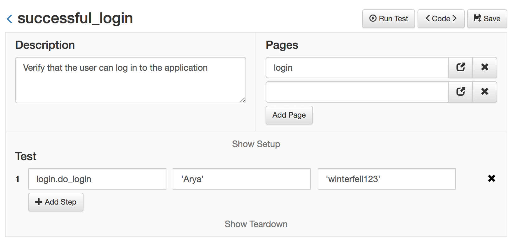

Custom Actions
==================================================

There are times when simple actions like *click* or *send keys* are not enough and more complex actions are required. Also, when a group of actions are repeated over many tests, they should be grouped into a single function and written once in a single place. This greatly improves the maintenance of the tests.

This custom functions/actions should be defined inside the pages.

**Let's see a simple example**

Consider the case of making a login to a web application. It usually takes 3 or more steps and is used in almost all the tests. So instead of repeating the same steps, test after test, we can define a 'login' function inside the login page, like so:

**login.py**
```python
from golem.core import actions


username_input = ('id', "username", 'username')

password_input = ('id', "password", 'password')

login_button = ('css', "button[type='submit']", 'login_button')


def do_login(username, password):
    actions.send_keys(username_input, username)
    actions.send_keys(password_input, password)
    actions.click(login_button)

```

Now, this new action 'do_login' that we wrote is available as a normal action whenever we import the login page to a test, like so:


**successful_login.py**
```python
description = 'Verify that the user can log in to the application'

pages = ['login']

def test(data):
    login.do_login('arya', 'winterfell123')

```

And this is how it looks when using the Web Module:




##### Using Golem actions inside functions

To use the default golem actions inside a function, you can do the following:

**some_page.py**
```python
from golem.core import actions


my_input = ('id', 'myInput')

my_button = ('id', 'myButton')


def some_function(text):
    actions.send_keys(my_input, text)
    actions.click(my_button)

```


##### Finding elements dynamically

Sometimes you have to define selectors dynamically. For that, Golem provides two functions: *element()* and *elements()*. 

The first, *element()*, returns a pure selenium [WebElement](https://seleniumhq.github.io/selenium/docs/api/py/webdriver_remote/selenium.webdriver.remote.webelement.html#module-selenium.webdriver.remote.webelement) (equivalent to find_element_by_*). The WebElement returned has two added functions: *find()* and *find_all()* that let's you chain find funcions to search for elements and sub-elements.

The second function, *elements()*, returns a list of selenium WebElements (equivalent to find_elements_by_*)

Let's see an example using *element()*, *elements()*, *find()* and *find_all()*:

**some_page.py**
```python
from golem.selenium.utils import element, elements


def verify_page_title(title_text):
    title = element(id='titleId')
    if not title.text == title_text:
        raise Exception('Title value is incorrect')


def verify_amount_of_items(amount):
    list_element = element(id='listId')
    list_items = list_element.find_all(css='li>span')
    if not len(list_items) == amount:
        raise Exception('List has incorrect amount of items')


def click_submit_button():
    element(id='formId').find(css='button.submit').click()

```

##### A more complex function

Let's imagine our application has a table that displays the results of a search, and the table looks like this:


<table id="resultsTable"> 
    <thead> 
        <tr> 
            <th>Name</th>
            <th>Age</th>
            <th>Wolf Name</th>
        </tr>
    </thead>
    <tbody>
        <tr>
            <td>Jon</td>
            <td>14</td>
            <td>Ghost</td> 
        </tr>
        <tr>
            <td>Brandon</td>
            <td>7</td>
            <td>Summer</td> 
        </tr>
        <tr>
            <td>Arya</td>
            <td>9</td>
            <td>Nymeria</td> 
        </tr>
        <tr>
            <td>Rickon</td>
            <td>2</td>
            <td>Shaggydog</td> 
        </tr>
        <tr>
            <td>Robb</td>
            <td>14</td>
            <td>Grey Wind</td> 
        </tr>
    </tbody>
</table>

The test needs to verify that a certain owner has the correct wolf. The catch here is that the table is dynamic, that is, the order of the rows and the value of the cells might change from time to time. This makes it difficult to write a selector that points to the cell we need to find because as soon as a row is added or removed, the selector will stop working.

To sort this obstacle, the solution is to go through the table row by row and cell by cell looking for the exact row and cell that we need, no matter the actual location. 

With Golem this is quite easy to do, check the following example:


**results_page.py**
```python
from golem.selenium.utils import element


def verify_wolf_name(owner, wolf_name):
    rows = element(id='resultsTable').find_all('tbody>tr')
    for row in rows:
        cells = row.find_all('td')
        if cells[0].text == owner:
            if cells[2].text == wolf_name:
                return
            else:
                raise Exception('Wolf name for {} is invalid'
                                .format(owner))

    raise Exception('Owner {} was not found in the table'
                    .format(owner))
```

*Explanation*:

We define a function that receives two parameters: the name of the owner and the name of the wolf.
In first place, we find all the rows of the table, and store them in a *rows* list.
For each row in the *rows* list we search for all the cells of that row (*row.find_all('td')*) and store them in the *cells* list.
Then we ask if the first cell value is equal to the name of the owner, if this is the case, this is the row we are looking for. We then ask if the third cell value is equal to the wolf name. This is the actual validation.


Next, go to [The CLI](the-cli.html)
