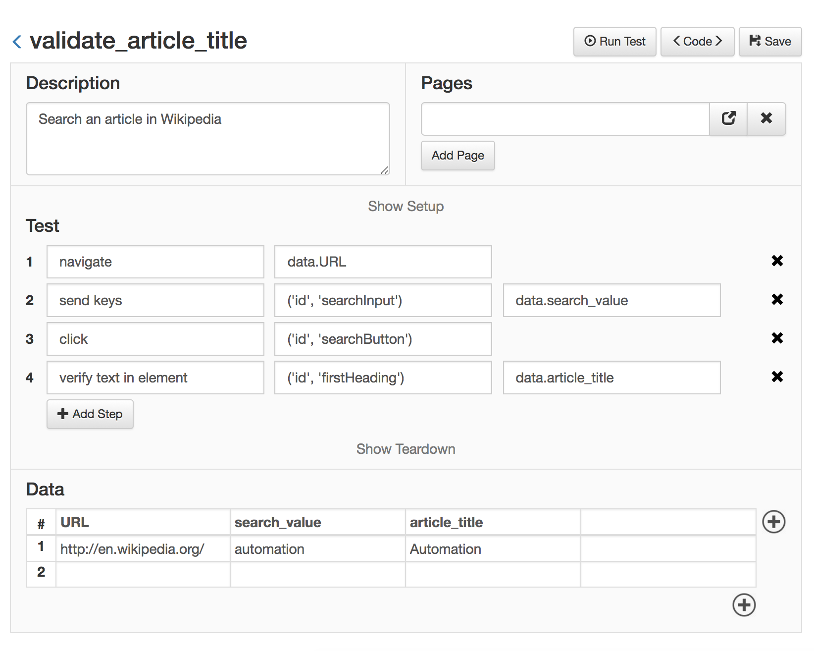

Managing Test Data
==================================================

The data for each test can be stored inside the test file or in a separate CSV file. To select which location should Golem use, set the *test_data* setting to 'csv' or 'infile'.

**Note**: All CSV values are considered strings. If you need different value types use 'infile' setting.


#### Using the Data Table

Let's rewrite the previous example but extracting all the data values outside of the code:

**validate_article_title.py**
```python

description = 'Search an article in Wikipedia'

def test(data):
    go_to(data.URL)
    send_keys(('id', 'searchInput'), data.search_value)
    click(('id', 'searchButton'))
    verify_text_in_element(('id', 'firstHeading'), data.article_title)

def teardown(data):
    close()

```

**validate_article_title.csv**

<table>
    <thead>
        <tr>
            <th>URL</th>
            <th>search_value</th>
            <th>article_title</th>
        </tr>
    </thead>
    <tbody>
        <tr>
            <td>http://en.wikipedia.org/</td>
            <td>automation</td>
            <td>Automation</td>
        </tr>
    </tbody>
</table>


With this improvement, we don't have to modify the code each time the test values change.

With the Web Module, the result is the following:





**Multiple data sets**

If you need to execute the same test, but with different values each time (the steps are the same but the input and output values change) more data sets can be added (more rows to the data table). The same test will be run once per each row in the data table.


For example, consider the previous data file, but with added rows:

<table>
    <thead>
        <tr>
            <th>URL</th>
            <th>search_value</th>
            <th>article_title</th>
        </tr>
    </thead>
    <tbody>
        <tr>
            <td>http://en.wikipedia.org/</td>
            <td>automation</td>
            <td>Automation</td>
        </tr>
        <tr>
            <td>http://en.wikipedia.org/</td>
            <td>webdriver</td>
            <td>Selenium (software)</td>
        </tr>
        <tr>
            <td>http://es.wikipedia.org/</td>
            <td>chimichanga</td>
            <td>Chimichanga</td>
        </tr>
        <tr>
            <td>http://fr.wikipedia.org/</td>
            <td>soupe à l'oignon</td>
            <td>Soupe à l'oignon</td>
        </tr>
    </tbody>
</table>

Using that data file, Golem will run the same test 4 times, using each time a different data set.

<div class="admonition note">
    <p class="first admonition-title">Check this out</p>
    <p>In the third and fourth rows we used a different URL, so we can even point the same test to different environments by just changing the data sets.</p>
</div>

####Infile data

When using *"test_data": "infile"* different Python variable types can be used. **Strings must be defined in quotes**.


The test code looks like this:

**test_with_infile_data.py**
```
description = 'Hey! this test has infile data!'

data = [
    {
        'numbers': 12,
        'boolean': False,
        'none': None,
        'list': [1,2,3],
        'dict': {'key': 'string'},
        'tuple': (1, '2', 3.0),
        'str_single': 'test',
        'str_double': "test",
    },
    {
        'numbers': 12,
        'boolean': True,
        'none': None,
        'list': ['a', 'b', 'c'],
        'dict': {"key": 12},
        'tuple': ('a', 'a"b"c', "a'b'c"),
        'str_single': 'a "b" c',
        'str_double': "a 'b' c",
    },
]

def test(data):
    navigate('some_url')
    send_keys(('id', 'searchInput'), data.str_single)
    
```

Data is stored as a list of dictionaries. Each dictionary is a different test set. The test will be run once per heach test set.


Next, go to [Using Page Objects](using-page-objects.html)
