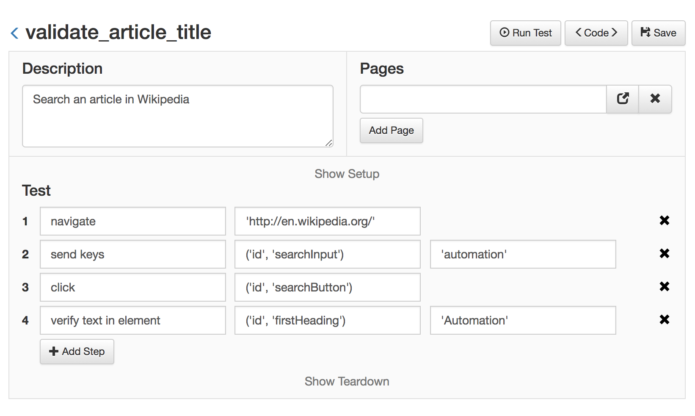
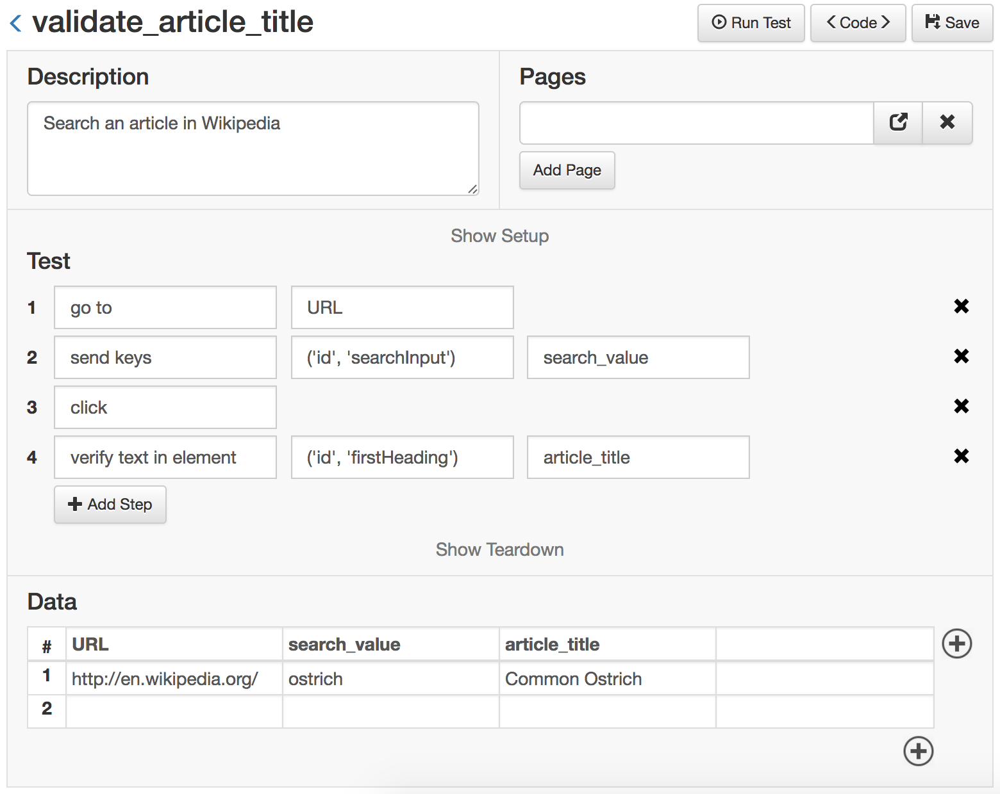
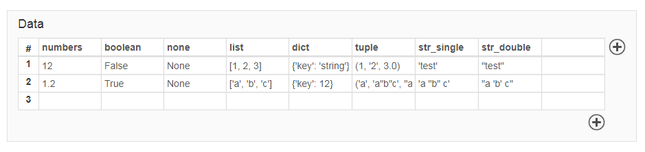
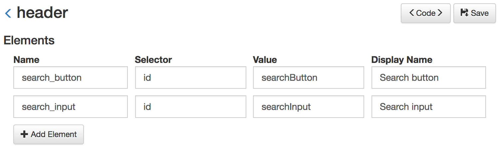
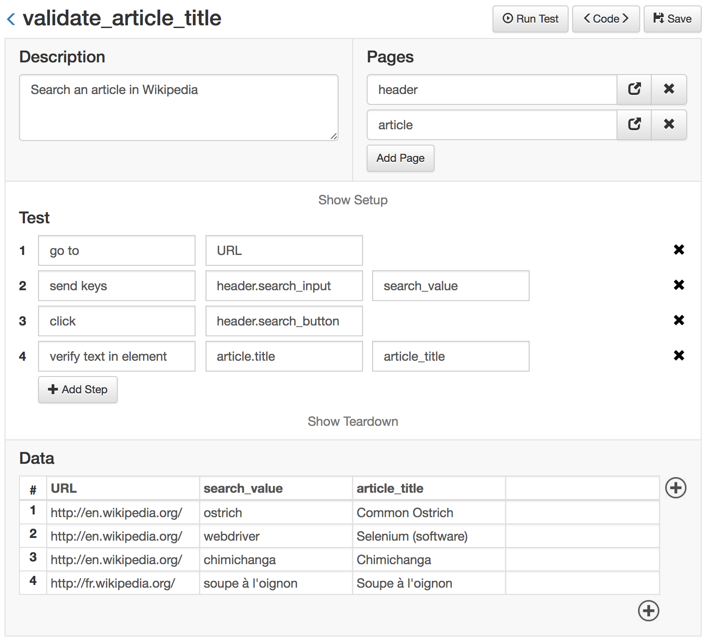

Tutorial - Part 2
==================================================


## Adding a New Test

**Tests** are Python files and need to be placed inside the *tests* folder of a project.

To create a new **test** use the following command:

```
golem createtest <project name> <test name>
```

A test can also be created from the Web Module.

A new test will have the following structure:

```python

description = ''

pages = []

def setup(data):
    pass

def test(data):
    pass

def teardown(data):
    pass

```

And the same test as seen with the Web Module:


The **description** is used to define the goal of the test and its value is displayed in the generated report, afterward. The description is optional.

**Pages** is a list of the pages of the application under test that this test will interact with. More about pages later.

After that, a test implements three functions: **setup**, **test**, and **teardown**. These functions are always executed in that order.

Use the **setup** function to separate the preconditions from the main test steps.

The **test** method should contain the steps of the test and should have at least one assertion or validation at the end.

The **teardown** function is always executed, even if the other functions fail. So use the Teardown function to run final commands needed to set everything back to the original position.

### A test example

Next is a bare minimum test that navigates to 'en.wikipedia.org', searches an article and validates that the title of the article is correct.


**validate_article_title.py**
```python

description = 'Search an article in Wikipedia'

def test(data):
    navigate('http://en.wikipedia.org/')
    send_keys(('id', 'searchInput'), 'automation')
    click(('id', 'searchButton'))
    verify_element_text(('id', 'firstHeading'), 'Automation')

```

From the Web Module:




### Golem Actions

In the previous example, *navigate*, *send_keys*, *click*, and *verify_element_text* are Golem actions. Check out [the entire list of actions](golem-actions.html) for more information.


### Opening and Closing the Browser

There is no need to open or close the browser.
The first action that requires a browser will open one. At the end, Golem will close the browser.
However, this can be done explicitly with the *open_browser* and *close_browser* actions.


## Running a Test

To run the test just press the 'Run Test' button in the Web Module or run the following command:

```
golem run <project_name> validate_article_title
```


## Managing Test Data

The data for each test can be stored inside the test or in a separate csv file.

To select which location Golem should use, set the *test_data* setting to 'csv' or 'infile'.

**Note**: All csv values are considered strings. If you need different value types use the 'infile' setting.


### Using the Data Table

Let's rewrite the previous test but extracting all the data outside of the code:

The values of a test can be defined using the data table in the Web Module at the bottom of the test builder.
This will generate a csv file in the same folder as the test with the following data:

**validate_article_title.csv**
```
URL,search_value,article_title
http://en.wikipedia.org/,automation,Automation
```

Then we refactor the test to use the data object instead of hardcoded values:

**validate_article_title.py**
```python
description = 'Search an article in Wikipedia'

def test(data):
    go_to(data.URL)
    send_keys(('id', 'searchInput'), data.search_value)
    click(('id', 'searchButton'))
    verify_element_text(('id', 'firstHeading'), data.article_title)
```

This is the final result:




### Multiple data sets

The test will be executed once per each row in the CSV file. Each row is considered a **data set**.

For example, consider the previous data file, but with more rows:

**validate_article_title.csv**
```text
URL,search_value,article_title
http://en.wikipedia.org/,automation,Automation
http://en.wikipedia.org/,webdriver,Selenium (software)
http://es.wikipedia.org/,chimichanga,Chimichanga
http://fr.wikipedia.org/,soupe à l'oignon,Soupe à l'oignon
```

Using this data file, Golem will run the same test 4 times, using each time a different data set.

<div class="admonition note">
    <p class="first admonition-title">Check this out</p>
    <p>In the third and fourth rows we used a different URL, so we can even point the same test to different environments by just changing the data sets.</p>
</div>

### Infile data

When using *"test_data": "infile"* in settings.json different Python variable types can be used. **Strings must be defined in quotes in the Web Module data table**.



The test code looks like this:

**test_with_infile_data.py**
```
description = 'Hey! this test has infile data!'

data = [
    {
        'numbers': 12,
        'boolean': False,
        'none': None,
        'list': [1,2,3],
        'dict': {'key': 'string'},
        'tuple': (1, '2', 3.0),
        'str_single': 'test',
        'str_double': "test",
    },
    {
        'numbers': 12,
        'boolean': True,
        'none': None,
        'list': ['a', 'b', 'c'],
        'dict': {"key": 12},
        'tuple': ('a', 'a"b"c', "a'b'c"),
        'str_single': 'a "b" c',
        'str_double': "a 'b' c",
    },
]

def test(data):
    navigate('some_url')
    send_keys(('id', 'searchInput'), data.str_single)
    
```

Infile data is stored as a list of dictionaries. Each dictionary is a different test set.


## Using Page Objects

If you remember from the previous example, each time the test interacted with a web element (an HTML tag), the selector for that element was defined right there inside the step. That will make the tests hard to maintain, especially when the application under test changes.


### Defining Page Objects

It is a good practice to keep the selectors of the web elements outside of the test, and declared once in a single place.
That place should be a **Page Object**.

A Page Object represents an entire page of the application (or a part of a page, like the header or the menu).
Inside the Page Object, the elements of the page can be defined so they can be used later in the tests. 

Let's see an example. Consider the previous test (validate_article_title).
Let's extract all the element selectors and put them inside Page Objects.

For this, we create two page objects. The first will be the 'header', as it's the same header for every page of the application.
The second page object will be the 'article'.

**header.py**
```python

search_input = ('id', 'searchInput')

search_button = ('id', 'searchButton')

```

**article.py**
```python

title = ('id', 'firstHeading')

```

These pages, as seen with the Web Module, look like this:




### Using Pages Inside Tests

Having these two pages created, we can use them in our test, and refactor it as follows:

**validate_article_title.py**
```python
description = 'Search an article in Wikipedia'

pages = ['header', 'article']

def test(data):
    navigate(data.URL)
    send_keys(header.search_input, data.search_value)
    click(header.search_button)
    verify_element_text(article.title, data.article_title)
```

And from the Web Module:




With this change, the 'Search input', 'Search button' and 'Article Title' elements are defined in a separate file.
A test that needs to interact with these elements, just needs to import the page object and reference them.
This reduces the required time to write new tests and the maintenance of existing tests.
In the future, when the selector of an element changes, even if it's used by hundreds of tests, its definition needs to be modified in a single file.


## Creating a suite

A suite lets you arbitrarily select a subset of all the tests to execute as a group.
Let's say, you want to test only the most important tests or the tests for a specific module.

A suite contains a list of *tests*, *browsers*, *environments*, *tags*, and the number of *processes*.
Consider the following example:


**full_regression.py**
```python

browsers = ['firefox', 'chrome']

environments = []

processes = 2

tags = []

tests = [
    'test1',
    'test2',
    'some_folder.test3',
]
```


<div class="admonition note">
    <p class="first admonition-title">Note</p>
    <p>This suite will execute all marked tests, once per each browser, environment and test set</p>
</div>


### Test Parallelization

The ```processes = 2``` tells Golem how many tests should be executed at the same time. The default is one (one at a time).
How many tests can be parallelized depends on your test infrastructure.


### Execution report

When the suite finishes a JSON report is generated in the *reports* folder. This report can be visualized using the Web Module. 

<br>

That's it! The basic tutorial ends here.
Feel free to learn more about Golem using the table of contents.
Happy testing!
