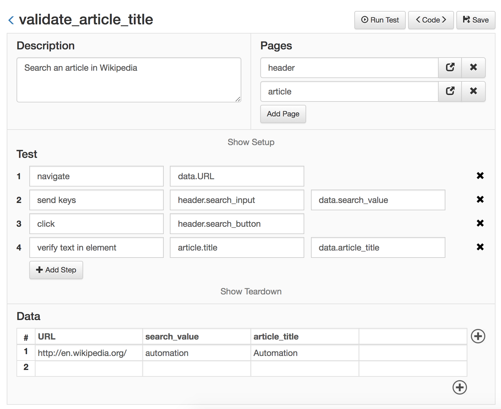

Using Page Objects
==================================================

If you remember from the previous example, each time the test interacted with a web element (an HTML tag), the selector for that element was defined inside the same test. That is going to lead only to trouble down the road. 

Imagine what would happen when the application under tests changes. If a selector for a web element changes and that web element is used in hundreds of tests, it would need to be fixed in all the tests, one by one, consuming a lot of time.

##### Defining Page Objects

It is a good practice to keep selectors of the web elements outside of the test, and declared once in a single place. That place should be a **Page Object**.

A Page Object represents an entire page of the application (or a part of a page, like the header or the menu). Inside that Page Object, you can define the selectors for all the web elements that your test is going to interact with. 

You can also define complex actions that the tests can perform inside that page, this take the form of fuctions. More on this later.

Let's see an example, consider the previous test:

**validate_article_title.py**
```python

description = 'Search an article in Wikipedia'

def test(data):
    go_to(data.URL)
    send_keys(('id', 'searchInput'), data.search_value)
    click(('id', 'searchButton'))
    verify_text_in_element(('id', 'firstHeading'), data.article_title)

def teardown():
    close()

```

Let's extract all the selectors and put them inside Page Objects. For this, we create two page objects, the first will be the 'header' page object, as it's the same header for every page of the application. The second page object will be the 'article' page.

**header.py**
```python

search_input = ('id', 'searchInput', 'Search input')

search_button = ('id', 'searchButton', 'Search button')

```

**article.py**
```python

title = ('id', 'firstHeading', 'Title')

```

These pages, as seen with the Web Module, look like this:


##### Using pages inside tests

Having these two pages defined, we can use them in our test, and refactor it as follows:

**validate_article_title.py**
```python

description = 'Search an article in Wikipedia'

pages = ['header', 'article']

def test(data):
    go_to(data.URL)
    send_keys(header.search_input, data.search_value)
    click(header.search_button)
    verify_text_in_element(article.title, data.article_title)

def teardown():
    close()

```

And from the Web Module:



**Explanation**

With this change, the 'Search input', 'Search button' and 'Article Title' elements are defined in a separate file from the test itself. A test that needs to interact with this element, just needs to import the page object and referece it, reducing the required time to write new tests. In the future, if the HTML of that element changes, only the selector defined in the page object needs to be updated, the test code would remain the same.


Next, go to [Suites](suites.html)
